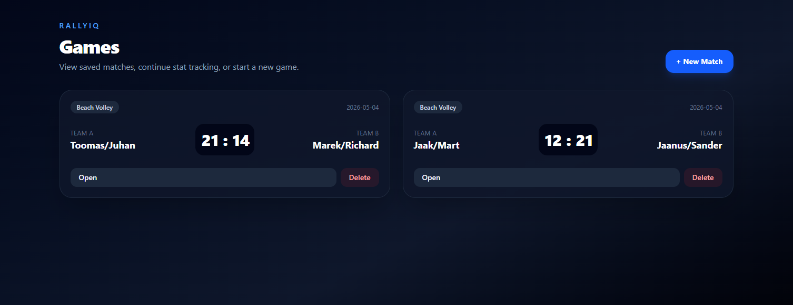
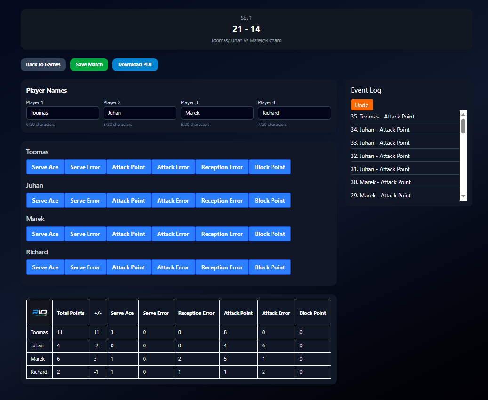

# RallyIQ – Volleyball Statistics App

**Full-stack web application** for tracking volleyball matches and player statistics.



## ✨ Features

- 🏐 Create and manage matches
- 📊 Track detailed player statistics:
  - Points
  - Errors
  - Serves
  - Blocks
- ⚡ Real-time stat updates during matches
- 🧠 Structured event logging system
- 📁 Persistent data storage (PostgreSQL)
- 📜 Match history tracking

 <!-- Lisa siia ekraanipilt hiljem -->

## 🌍 Deployment

- **Frontend:** Deployed on Vercel
- **Backend API:** Hosted on Render
- **Database:** PostgreSQL (cloud)

The frontend communicates with the backend via REST API.

## 🛠 Tech Stack

**Frontend:**
- React
- TypeScript
- Tailwind CSS

**Backend:**
- Node.js
- Express
- PostgreSQL

## 🧠 Key Concepts & Implementation

- State-driven stat tracking system  
- Dynamic player-based data mapping  
- REST API for match and stats management  
- Separation of frontend and backend logic  
- Scalable structure for future AI integration  

## ▶️ Run locally

### Backend

```
cd backend
npm install
npm run dev
```

### Frontend

```
cd frontend
npm install
npm run dev
```
## 🔮 Future Improvements

- 🎥 Video upload & automatic event detection (AI)  
- 📊 Advanced analytics (efficiency %, trends)  
- 👥 User authentication & multi-user support  
- ☁️ Cloud storage for matches and videos  
- 📤 Export stats (PDF / CSV)  

---

Built as a fullstack learning project.
